# 🛒 Retail Orders SQL Analysis Project

> A structured SQL-driven exploration of retail transactional data spanning **2022–2023**, uncovering revenue drivers, regional trends, seasonal patterns, and year-over-year profitability shifts.


---

## 📌 Table of Contents

- [Project Overview](#-project-overview)
- [Objectives](#-objectives)
- [Dataset](#-dataset)
- [Project Flow](#-project-flow)
- [Key Insights](#-key-insights)
- [Recommendations](#-recommendations)
- [Project Structure](#-project-structure)
- [How to Run](#-how-to-run)

---

## 📖 Project Overview

This project analyses a retail orders dataset to derive actionable business intelligence using **T-SQL analytical queries** in Microsoft SQL Server, with supporting data exploration in a **Python/Jupyter Notebook** environment.

The analysis covers two full fiscal years (2022 and 2023) and addresses product performance, regional sales distribution, month-over-month growth trends, and sub-category profitability comparison. Findings are consolidated in a structured [Analysis Report](./Retail_Orders_Analysis_Report.md).

| Detail | Value |
|--------|-------|
| **Period Covered** | January 2022 – December 2023 |
| **Primary Tool** | Microsoft SQL Server (T-SQL) |
| **Supporting Tools** | Python, Pandas, Jupyter Notebook |
| **Data Source** | `orders.csv` (retail transactional data) |
| **Author** | Abdussalam Oluwaseun |

---

## 🎯 Objectives

The project answers six core business questions:

| # | Business Question |
|---|-------------------|
| 1 | Which are the **Top 10 Highest Revenue-Generating Products**? |
| 2 | Which are the **Top 5 Best-Selling Products in Each Region**? |
| 3 | What is the **Month-over-Month (MoM) Sales Growth** across 2022–2023? |
| 4 | How does **MoM Sales Compare between 2022 and 2023** for the same calendar months? |
| 5 | For each **Category, which Month-Year recorded the highest sales**? |
| 6 | Which **Sub-Category achieved the highest profit growth** in 2023 vs. 2022? |

---

## 🗄️ Dataset

The dataset (`orders.csv`) is a flat-file retail transactions table loaded into SQL Server. Key fields include:

| Column | Type | Description |
|--------|------|-------------|
| `order_id` | INT (PK) | Unique order identifier |
| `order_date` | DATE | Date the order was placed |
| `region` | VARCHAR | Geographic sales region |
| `category` | VARCHAR | High-level product category |
| `sub_category` | VARCHAR | Granular product classification |
| `product_id` | VARCHAR | Unique product identifier |
| `list_price` | DECIMAL | Original listed price |
| `discount` | DECIMAL | Discount applied |
| `sales_price` | DECIMAL | Final transaction value |
| `profit` | DECIMAL | Profit earned per order line |
| `quantity` | INT | Units ordered |

---

## 🔄 Project Flow

```mermaid
flowchart LR
    KG["🔗 **kaggle api**\n━━━━━━━━━━━━\nDataset Source"]
    PY["**&lt;/&gt;**\n━━━━━━━━━━━━\nPython"]
    PD["**&lt;/&gt;**\n━━━━━━━━━━━━\nPython · Pandas"]
    SQL[("🗄️ **SQL Server**")]
    AN["📊 **Data Analysis\nusing SQL**"]

    KG -->|"⬇ Download Dataset"| PY
    PY -->|"Data Cleaning & Processing"| PD
    PD -->|"Load data"| SQL
    SQL -->|"Query & Analyse"| AN

    style KG fill:#e8f4fd,stroke:#2196F3,stroke-width:2px,color:#000
    style PY fill:#f5f5f5,stroke:#333,stroke-width:2px,color:#000
    style PD fill:#f5f5f5,stroke:#333,stroke-width:2px,color:#000
    style SQL fill:#fce4ec,stroke:#e91e8c,stroke-width:3px,color:#000
    style AN fill:#e8f5e9,stroke:#4CAF50,stroke-width:2px,color:#000
```



---

## 💡 Key Insights

### Growth Leaders (2022 → 2023)

| Sub-Category | 2022 Profit | 2023 Profit | Growth (%) |
|---|---|---|---|
| **Machines** | $9,980 | $14,500 | **+45.3% ▲** |
| **Binders** | $11,980 | $14,200 | **+18.5% ▲** |
| **Storage** | $12,620 | $14,630 | **+15.9% ▲** |
| **Phones** | $19,050 | $21,230 | **+11.4% ▲** |

### Profit Decline Areas

| Sub-Category | 2022 Profit | 2023 Profit | Decline (%) |
|---|---|---|---|
| **Appliances** | $8,740 | $5,230 | **-40.2% ▼** |
| **Copiers** | $11,900 | $7,770 | **-34.7% ▼** |
| **Tables** | $14,710 | $11,370 | **-22.7% ▼** |
| **Furnishings** | $5,970 | $4,810 | **-19.4% ▼** |

### Summary Observations

- ✅ **Technology is the growth engine** — Machines, Phones, and Binders are the top performers.
- ✅ **8 of 17 sub-categories** showed positive profit growth in 2023.
- ✅ **Regional bestsellers differ** — no single product dominates all regions, signalling healthy regional diversity.
- ⚠️ **Copiers and Appliances combined lost $7.64K in profit** year-over-year — the most acute risk areas.
- ⚠️ **Furniture is in systemic decline** — both Tables and Furnishings declined, suggesting structural margin compression.
- ⚠️ **Office Supplies are stagnating** — minimal growth in Art, Labels, and Envelopes.

---

## 📋 Recommendations

| Priority | Action | Expected Impact |
|----------|--------|-----------------|
| 🔴 **HIGH** | Investigate **Copiers & Appliances** decline — review pricing, discounts, and competitive pressure | Recover $7.64K+ in lost annual profit |
| 🔴 **HIGH** | Scale **Machines** investment — increase inventory and marketing for this 45% growth leader | Capitalise on momentum into FY2024 |
| 🟡 **MEDIUM** | Review **Furniture pricing strategy** — structural decline in Tables and Furnishings warrants margin audit | Stabilise profitability across the Furniture category |
| 🟡 **MEDIUM** | Build **regional promotional playbooks** using top-5 regional product data | Improve regional conversion rates and inventory planning |
| 🟡 **MEDIUM** | Align **seasonal campaigns** with peak-month findings per category | Reduce stockouts and improve promotional ROI |
| 🟢 **LOW** | Rationalise **stagnant Office Supplies SKUs** (Art, Labels, Envelopes) | Reduce operational complexity; redirect resources |
| 🟢 **LOW** | Implement **live MoM dashboards** for ongoing performance tracking | Enable faster, data-driven in-year course corrections |

---

## 📁 Project Structure

```
Retail Orders SQL Project/
│
├── SQL scripts/
│   ├── Schama.sql                      # Table schema definition
│   └── Analysis.sql                    # All 6 analytical queries
│
├── retails_orders_analysis.ipynb       # Python/Pandas data exploration notebook
├── orders.csv                          # Raw dataset
├── Retail_Orders_Analysis_Report.md    # Full analysis report
└── README.md                           # Project overview (this file)
```

---

## ▶️ How to Run

### 1. Set Up the Database

```sql
-- Run schema creation first
-- SQL scripts/Schama.sql

CREATE TABLE orders (
    order_id    INT PRIMARY KEY,
    order_date  DATE NOT NULL,
    ...
);
```

### 2. Import the Data

Load `orders.csv` into your SQL Server instance using the **Import Flat File Wizard** in SSMS or via `BULK INSERT`:

```sql
BULK INSERT orders
FROM 'C:\path\to\orders.csv'
WITH (
    FORMAT       = 'CSV',
    FIRSTROW     = 2,
    FIELDTERMINATOR = ',',
    ROWTERMINATOR   = '\n'
);
```

### 3. Run the Analysis Queries

Open `SQL scripts/Analysis.sql` in SSMS and execute each query block sequentially. Queries are clearly commented by section.

### 4. Explore in Jupyter (Optional)

```bash
# Activate virtual environment
.venv\Scripts\activate

# Launch Jupyter
jupyter notebook retails_orders_analysis.ipynb
```

---

> 📄 For the full detailed findings, see the [Analysis Report](./Retail_Orders_Analysis_Report.md).
